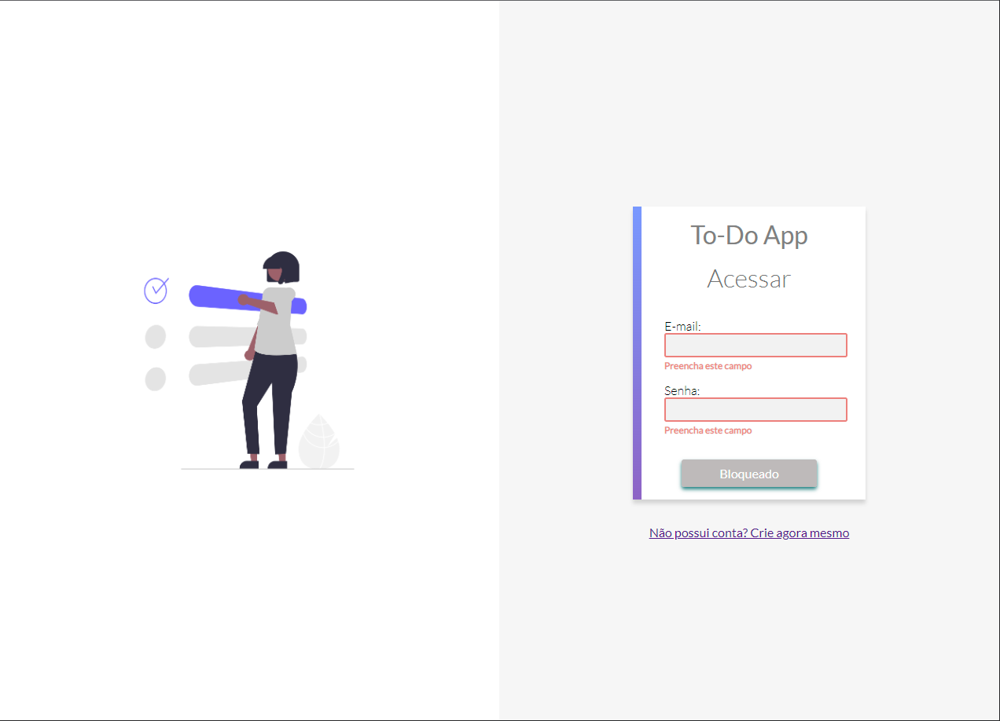
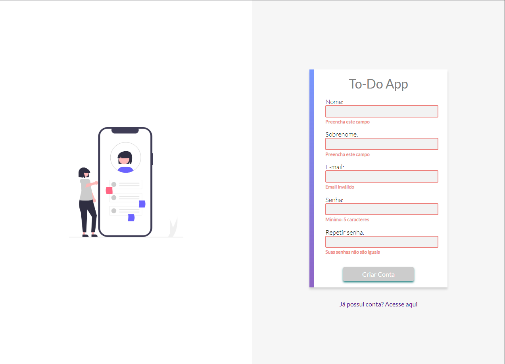
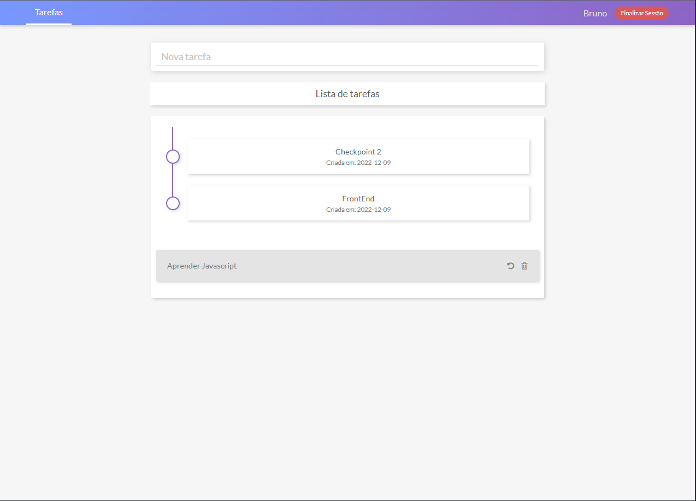

<h1 align="center" style="font-size: 50px"> To-do-App</h1>

  <a href="#tecnologies">Tecnologias</a>&nbsp;&nbsp;&nbsp;|&nbsp;&nbsp;&nbsp;
  <a href="#projects">Projeto</a>&nbsp;&nbsp;&nbsp;|&nbsp;&nbsp;&nbsp;
  <a href="#layouts">Layouts</a>&nbsp;&nbsp;&nbsp;|&nbsp;&nbsp;&nbsp;
  <a href="#developers">Desenvolvedores</a>

 

 

<h1 align="center">💻 Info do Projeto</h1> 

Este projeto consiste em um pequeno aplicativo de gerenciamento de tarefas, dentro do qual podemos realizar as seguintes atividades: 
- Ver tarefas pendentes. 
- Ver tarefas terminadas. 
- Marcar uma tarefa como terminada. 
- Criar tarefas novas. 
- Visualizar a data de criação de uma tarefa. 
- Remover tarefas. 
Além do citado acima, implementamos um sistema de autenticação de usuários, que inclui o processo de registro é login.

<h1 align="center" style="padding:20px">🔖 Layouts</h1>

<section align="center" style="display:flex; align-itens:center; justify-content:center; gap: 10px; flex-wrap:wrap; text-align: center; margin-bottom: 50px">

    
🖥️ Login

    

🖥️ Register account

🖥️ Tasks

</section>

  <h1 align="center">Desenvolvedores do Projeto</h1>

- [Bruno Chaves](https://www.linkedin.com/in/bchavs12/)
    - Principais atividades realizadas:
        - Gerenciamento do repositorio(Branchs,pullRequest)
        - Validação do formulario de registro
        - Criação do README.MD
        - Estilização da pagina Signup
        
- [Igor Cruz](https://github.com/IgorFreitasCruz)
    - Principais atividades realizadas:
        - Página de tarefas (CRUD)
        - Ação botão de finalizar app
        - Animação de carregamento (Spinner)
        - Refatoração do código
        - Animação skeleton (carregamento das tarefas)

- [Matheus Quirino](https://github.com/mthflashice)
    - Principais atividades realizadas:
        - Validações
        - 
        - 

- [Diovano Cassiano](https://github.com/diovanocf)
    - Principais atividades realizadas:
        - Validações 
        - 
        - 

- [Carlos roberto landerdahl](https://github.com/Carlos-Landerdahl)
    - Principais atividades realizadas:
        -  Validação do Login
        -  registro de enpoints(api)
        -  Estilização das páginas
  </ul>

